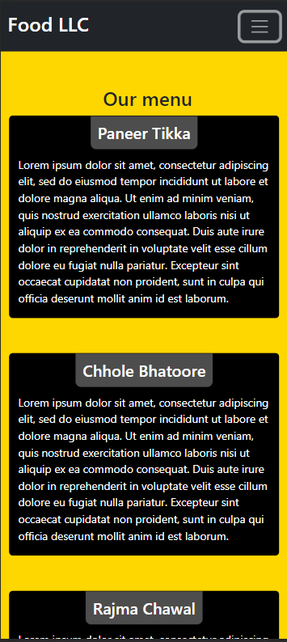
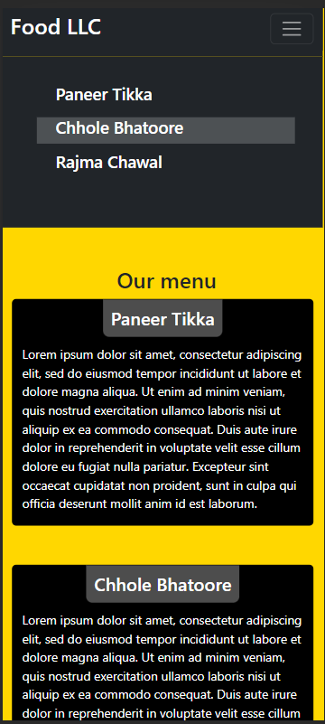
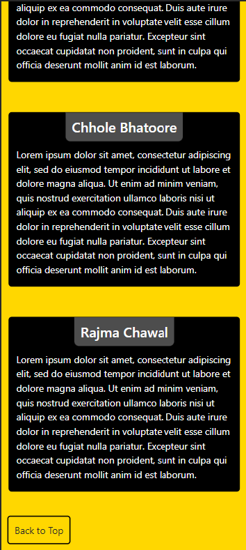
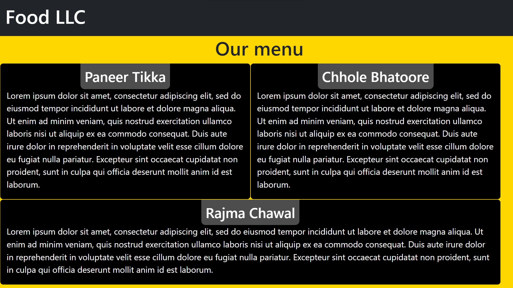
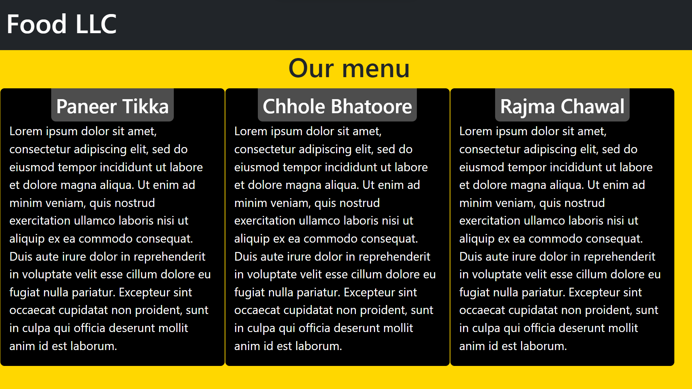

# module-3-coursera-web-dev

### Mobile Preview

    
    
    

<!-- <video width="320" height="800" controls>
  <source src="./video-mobile-view.mp4" type="video/mp4">
</video> -->

### Tablet Preview

### Web Preview

